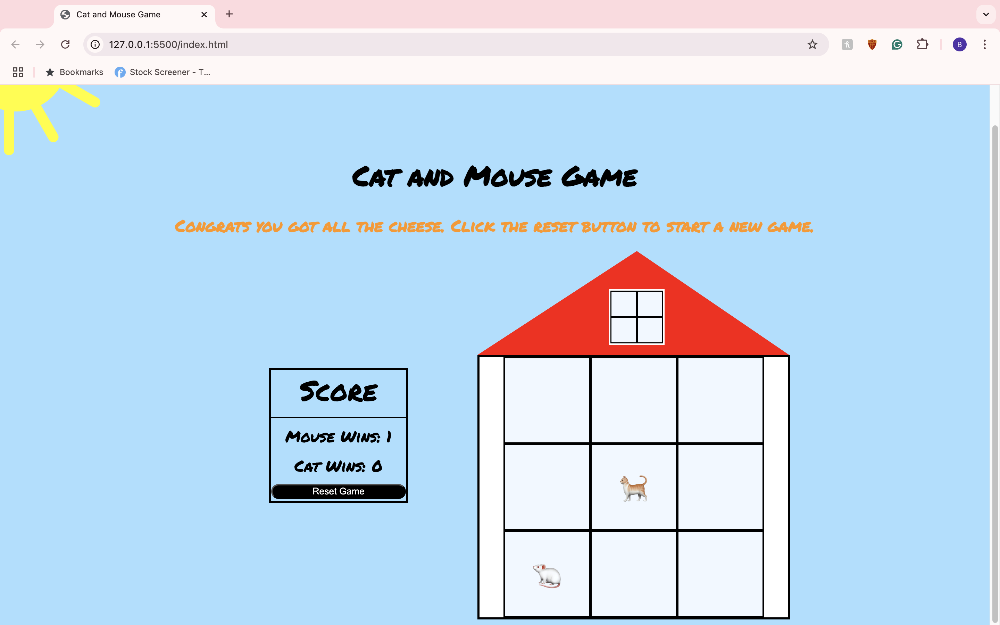

# Cat-and-Mouse-Game

## Project Description

"Cat and Mouse Game" is an online one-player versus computer game created to test the users ability to avoid the computers next move. The mouse (user) must collect all nine cheeses without landing on the same square as the cat (computer) to win. If the mouse is caught by the cat, then the mouse loses.

For the optimal experience, the game is best played in a Google Chrome web browser.

The game was built using HTML, CSS, and Javascript.

## Play Now

Deployed Website: https://glittering-starburst-88834e.netlify.app/

GitHub Repo: https://github.com/bschlo/Cat-and-Mouse-Game

### How to Play 
Load into gameplay.

Next, start the game by clicking any of the nine squares on the board.

Play through until the result pops up. Click the reset button to start a new game.

## User Stories

### MVP Goals
- As a player, I want my game to recognize that all 9 squares have been touched so the player can know they won.
- As a player, I want my game to recognize when the cat and mouse are on the same position so the player can know they lost.
- As a player, I would like to see the tally of how many wins or losses I have.
- As a player, I would like to reset the board after I have won or lost. 
- As a player, I would like to know when I click a position on the board, the mouse is on shown on that position

### Stretch Goals

- As a player, I would like to see a picture of cat or mouse displayed on the page.
- As a player, I would like the game to not just be completely random. I would like an aspect of skill such as moving the mouse one position up, down, left, or right in order to avoid the mouse.
- As a player, I would like to level up each time I win. Each level will include a bigger board and add another cat.
- As a player, I would like to hear victory noise if I win or a loser noise if I lose.
- As a player, I would like to add a multiplayer feature which one player can choose if they would like to be the cat or the mouse.

#### Next Steps
- Work on arrow key functionality, which includes moving the mouse and cat one space up, down, left, or right upon each turn.
- Add moving images as decoration to the web page.
- Add additional levels.

## Timeline

| Day        |   | Task                                                            | 
|------------|---|-----------------------------------------------------------------|
| Monday     |   | Create and present proposal. Get started on HTML.                                                                               |
| Tuesday    |   | Create basic game board and style. Start implementing JavaScript variables and event listeners. Establish a key for naming.                                   |          
| Wednesday  |   | Work through functions and ensure they work within the game.                               |          
| Thursday   |   | Continue to work on JavaScript and check for bugs in the code.                                 |          
| Friday     |   | Style the project.                                                   |          
| Monday     |   | Finalize MVP.                                                    |          
| Tuesday    |   | Work on stretch goals.                                          |          
| Wednesday  |   | Work on icebox items if applicable.                              |
| Thursday   |   | Presentation Day!                            

## Resources
- https://stackoverflow.com/
- https://developer.mozilla.org/en-US/
- https://chatgpt.com/